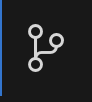
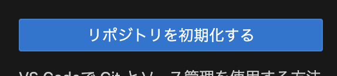
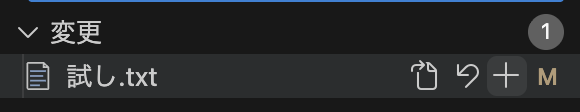

# gitについて

- gitとはファイルの管理システム。更新履歴を残しておける。
- リポジトリの作成方法

1 Finderにフォルダ作成。わかりやすければどこでもok。

2 vscodeでファイル→フォルダーを開くから1で作成したフォルダを選択。


## テキストの作成方法

1 アイコンクリックしてリポジトリの初期化




2 ファイルを新規作成

## コミット

1 +マークからステージに上げる。もしくはターミナルでaddコマンド。ステージにあげるあげないで更新するファイルしないファイルを選択可能



2 メッセージを入力してコミット。メッセージは必須。

```git commit -m “[comment]”```

## githubへのアップロード

home→Repositories→New→名前などを入力してCreate repository

initからの場合
```
echo "# tesu" >> README.md
git init
git add README.md
git commit -m "first commit"
git branch -M main
git remote add origin https://github.com/yuina-niijima/tesu.git
git push -u origin main
```
vscode側で初期化している場合

```
git remote add origin https://github.com/yuina-niijima/tesu.git
git branch -M main
git push -u origin main
```
上記コードをvscodeターミナルで使用

- その後の更新のアップロード

1. ```git add . / git add ファイル名```　でアップロードしたいファイルをステージに上げる。

1. ```git commit -m "message"```でコミット。メッセージは必須。変更内などを簡単に書く。

1. ```git push ```でgithubにアップロード


- コマンド(よく使うもの。随時追加。)

## ローカルにリポジトリを作成し、リモートにプッシュする
```
git init

git add .

git commit -m "Initial commit"

git remote add origin https://github.com/XXXX/XXXXXX.git

git push -u origin master
```

## ファイルの登録（コミットするため）

```git add <ファイル名>```


## ファイルの変更や追加をコミット

```git commit -m "コミットメッセージ"```


## ローカルの変更を確認する

```git status```


## commitの変更履歴を見る

```git log```


## リモートにpush

```git push origin <ブランチ名>```


## ラボレーション機能

repositries→共有したいフォルダ選択→setting→collaborations→add peapleからメアド入力で追加


## 直接mainにpushしてはいけない理由
- 壊れたコードが混入しやすい
- 誰が何をしたか追いにくく、prで履歴を可視化するため
- レビューが行われないため、品質が低下する

## Gitflowについて
- お天気アプリ作成においては、main及びfeature/spalashブランチを作成。適切なブランチを作成し派生を考える。

## アプリ開発時Gitのワークフロー
1. mainブランチでGitプルして最新化する
1. 作業用のブランチ作成＆空コミット作成する
1. 作業用ブランチをプッシュする
1. ドラフトPRを作成する
1. コードを書く
1. コードが完成したら作業用ブランチのドラフトを解除してレビュー依頼をする
1. レビューあれば対応
1. 承認後マージする

## ブランチのプロテクト
- 直pushを防ぐ。下記サイトを参考にする。
- うまくプロテクトできないとき
  - Enforcement statusはActiveになっているか？
  - Branch targeting criteriaにmainブランチを追加しているか？
- [参考サイト](https://docs.github.com/ja/repositories/configuring-branches-and-merges-in-your-repository/managing-protected-branches/managing-a-branch-protection-rule)

## 空コミット
- ```git commit --allow-empty -m "メッセージ"```
- プルリクエストを出す準備として、
- [参考サイト](https://qiita.com/katsukii/items/5368598cbecbaefd1ed8)


# VSCodeでGitマージする
1. gitアイコンクリック

1. 変更の箇所にカーソルを当てる

1. 三点リーダー→ブランチ→マージ

## マージのエラー
- 競合の解決方法(あとで調べる)

## 上流ブランチ
- 自分のローカルPCにあるブランチと、サーバー（GitHubなど）にあるブランチを紐付ける役割を持っている
- [参考サイト](https://qiita.com/tatsuya_1995/items/4b8871709d3efe688400)
- 'git config --global --add --bool push.autoSetupRemote true'次から自動で追跡ブランチ (上流ブランチ) が現在のブランチ名で設定される。新しいブランチを作って push してもエラーが出なくなる。
- [参考サイト](https://zenn.dev/ktansai/articles/b9b342bc80d868#%E6%99%AE%E6%AE%B5%E6%84%8F%E8%AD%98%E3%81%97%E3%81%AA%E3%81%84set-upstream%E3%81%AE%E4%BB%95%E7%B5%84%E3%81%BF%E5%BE%A9%E7%BF%92)

## ドラフトPR(プルリクエスト)
- まだ作業中だけど、とりあえず共有しておくねという意思表示。
作業を進めながらレビューをしてもらえる。直接マージできないので、誤ってマージしてしまうことがない。
- [参考サイト](https://zenn.dev/manase/scraps/976e424244e633)

## サル先生のgit入門
https://backlog.com/ja/git-tutorial/intro/01/

gitコマンド
https://qiita.com/2m1tsu3/items/6d49374230afab251337


